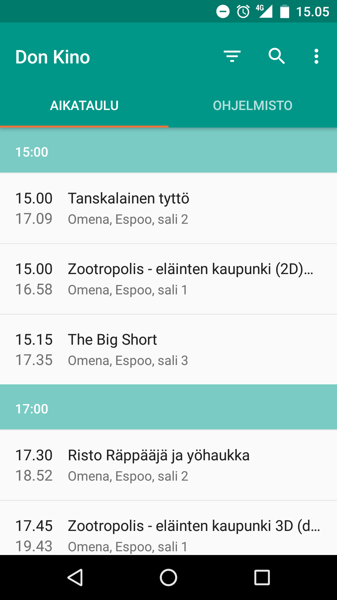
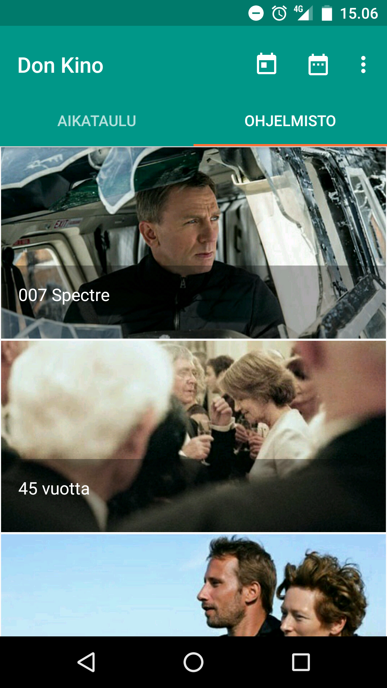
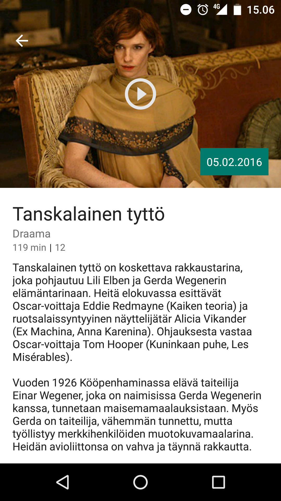

# Don-Kino
An Android application that displays schedule and events from Finn Kino API .

Application uses the following libraries:
- Butterknife
- Dagger2
- Glide
- ThreeTenABP
- Retrofit
- RxAndroid
- AppCompat, design, support, recyclerview
- Fabric

Screenshots of the current version (Sorry for the gigantic images): 

